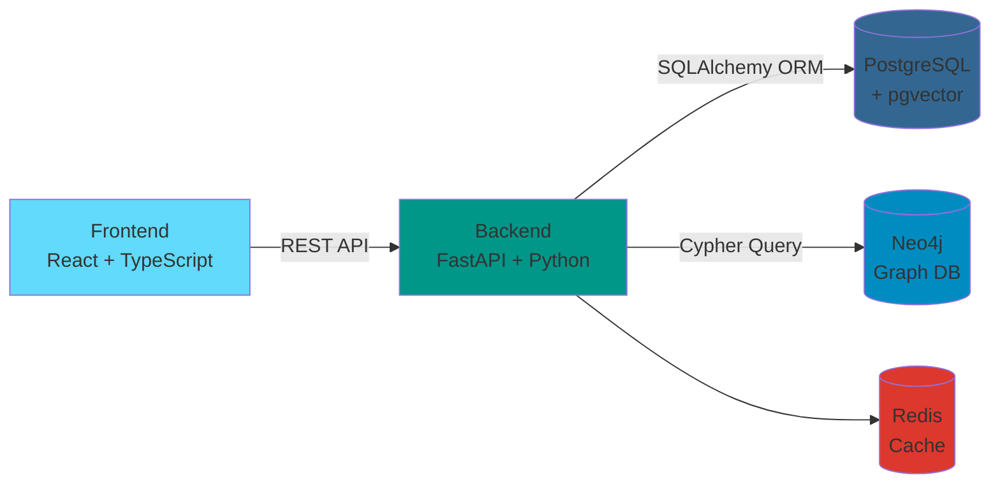
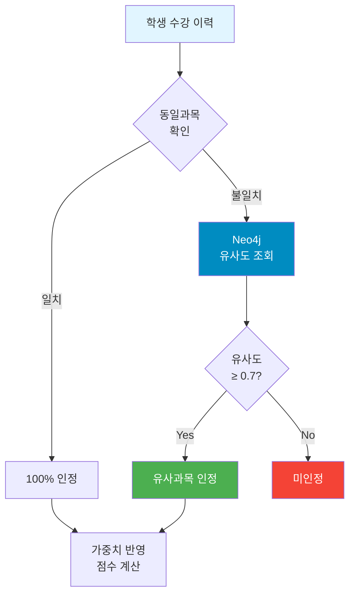
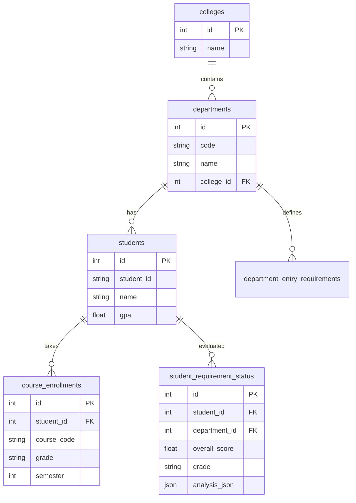

# 🦁 Lions Student Dashboard

> 한양대학교 LIONS 학생 관리 대시보드 - 학생 전공 적합도 평가 및 교과목 추천 시스템

---

## 📋 프로젝트 개요

**Lions Student Dashboard**는 한양대학교 학생들의 **전공 선택을 돕기 위한 AI 기반 평가 및 추천 시스템**입니다. 학생의 수강 이력을 분석하여 각 학과에 대한 적합도를 평가하고, Neo4j 그래프 데이터베이스를 활용하여 유사 교과목을 추천합니다.

### 🎯 핵심 기능

- **📊 학생 전공 적합도 평가**: 3-메트릭 기반으로 학생의 학과별 적합도를 정량적으로 평가
- **🔍 교과목 유사도 분석**: Neo4j 그래프 DB와 Sentence-BERT를 활용한 교과목 간 유사도 계산
- **💡 맞춤형 교과목 추천**: 학생의 수강 이력을 기반으로 유사 과목 및 연관 과목 추천
- **📈 대시보드**: 학생 통계, 평가 결과, 커리큘럼 정보를 직관적으로 시각화
- **⚙️ 관리자 기능**: 데이터 업로드, 진단 관리, 시스템 통계 확인

---

## 🏗️ 시스템 아키텍처

### 기술 스택



#### Frontend
- **React 19.2.0** - 모던 UI 컴포넌트
- **TypeScript** - 타입 안전성
- **Vite** - 빠른 빌드 및 개발 서버
- **Tailwind CSS** - 유틸리티 기반 스타일링
- **Lucide React** - 아이콘 라이브러리

#### Backend
- **FastAPI (Python 3.12)** - 고성능 비동기 웹 프레임워크
- **SQLAlchemy 2.0** - ORM
- **PostgreSQL + pgvector** - 관계형 DB + 벡터 검색
- **Neo4j** - 교과목 유사도 그래프 DB
- **uv** - 빠른 패키지 관리
- **Pydantic** - 데이터 검증

#### Infrastructure
- **Docker & Docker Compose** - 컨테이너 오케스트레이션
- **Redis** - 캐싱 및 메시지 브로커

---

## 📊 핵심 평가 알고리즘

### 3-메트릭 기반 평가 체계

학생의 전공 적합도는 다음 3가지 메트릭으로 평가됩니다:

```
┌─────────────────────────────────────────────────────────────────┐
│                    종합 점수 계산식                             │
├─────────────────────────────────────────────────────────────────┤
│                                                                 │
│  총점 = 진입요건 충족(40%) + 권장과목 이수(30%)                │
│         + 교육과정 이수(30%)                                    │
│                                                                 │
│  ┌──────────────────────────────────────────────────┐          │
│  │ 1️⃣ 진입요건 충족 (40%)                          │          │
│  │    • 필수과목 이수 비율 계산                     │          │
│  │    • 진입요건 없으면 100% 부여                   │          │
│  └──────────────────────────────────────────────────┘          │
│                                                                 │
│  ┌──────────────────────────────────────────────────┐          │
│  │ 2️⃣ 권장과목 이수 (30%)                          │          │
│  │    • 동일과목: [학과+학수코드] 정확 일치         │          │
│  │    • 유사과목: Neo4j 유사도 ≥ 0.7 인정          │          │
│  └──────────────────────────────────────────────────┘          │
│                                                                 │
│  ┌──────────────────────────────────────────────────┐          │
│  │ 3️⃣ 교육과정 이수 (30%)                          │          │
│  │    • 1학년 과목 동일/유사 이수 비율              │          │
│  │    • Neo4j 그래프로 유사과목 판정                │          │
│  └──────────────────────────────────────────────────┘          │
│                                                                 │
│  등급: A(≥90) | B(≥80) | C(≥70) | D(≥60) | F(<60)             │
└─────────────────────────────────────────────────────────────────┘
```

### Neo4j 유사도 분석 워크플로우



---

## 📁 프로젝트 구조

```
LionsStudentDashboard/
├── 📂 backend/                    # FastAPI 백엔드
│   ├── 📂 models/                # 데이터 모델
│   │   ├── models.py             # SQLAlchemy ORM (11개 테이블)
│   │   └── schemas.py            # Pydantic 스키마
│   ├── 📂 routers/               # API 엔드포인트
│   │   ├── students.py           # 학생 관리
│   │   ├── courses.py            # 강좌/학과
│   │   ├── surveys.py            # 설문조사
│   │   ├── evaluation.py         # ⭐ 평가 알고리즘
│   │   ├── dashboard.py          # 통계 대시보드
│   │   ├── admin.py              # 관리자 기능
│   │   └── graph.py              # ⭐ Neo4j 그래프 분석
│   ├── 📂 services/              # 비즈니스 로직
│   │   ├── evaluation_service.py # 평가 시스템 핵심
│   │   ├── graph_service.py      # Neo4j 연동
│   │   └── student_service.py    # 학생 서비스
│   ├── 📂 data/                  # 커리큘럼 JSON
│   │   ├── sw.json               # 컴퓨터학부
│   │   ├── dataIntelli.json      # 데이터인텔리전스
│   │   ├── necessary.json        # 진입요건
│   │   └── recommended.json      # 권장과목
│   ├── main.py                   # FastAPI 진입점
│   └── seed_data.py              # 초기 데이터 시딩
│
├── 📂 frontend/                   # React 웹 앱
│   └── 📂 src/
│       ├── App.tsx               # 메인 애플리케이션
│       ├── api.ts                # REST API 클라이언트
│       ├── types.ts              # TypeScript 타입
│       └── 📂 components/
│           ├── DashboardView.tsx      # 통계 대시보드
│           ├── StudentDetailView.tsx  # 학생 평가 상세
│           ├── CurriculumView.tsx     # 커리큘럼 조회
│           └── AdminView.tsx          # 관리자 패널
│
├── 📂 graphDB/                    # Neo4j 그래프 모듈
│   ├── course_similarity_graph.py  # 그래프 빌더
│   ├── course_graph_analysis.py    # 분석 알고리즘
│   ├── quick_start.py              # 빠른 시작 스크립트
│   └── final_course.csv            # 교과목 데이터 (854개)
│
├── docker-compose.yml             # Docker 오케스트레이션
├── ARCHITECTURE.md                # 상세 아키텍처 문서
├── README.md                      # 프로젝트 가이드
└── 요구사항_정리.md                # 요구사항 문서
```

---

## 🗄️ 데이터베이스 스키마

### PostgreSQL (관계형 DB)

총 **11개 테이블**로 구성되어 있습니다:



주요 테이블:
- `students` - 학생 정보 (303명)
- `departments` - 학과 정보 (40개)
- `courses` - 교과목 정보
- `course_enrollments` - 수강 이력
- `student_requirement_status` - **평가 결과 캐시** (12,120개 = 303명 × 40개 학과)

### Neo4j (그래프 DB)

교과목 간 유사도를 그래프로 표현합니다:

```
(Course)─[:SIMILAR_TO {similarity: 0.85}]→(Course)
    │
    └─[:IDENTICAL_ID]→(Course)

Course 노드 속성:
- id, code, name, department
- category, credits, description
```

- **노드**: Course (854개)
- **관계**: SIMILAR_TO (유사도 ≥ 0.8)
- **관계**: IDENTICAL_ID (동일 학수번호, 다른 학과)

---

## 🚀 빠른 시작

### 필수 요구사항

- Docker Desktop
- Git

### 1. 프로젝트 클론

```bash
git clone https://github.com/mjwoon/LionsStudentDashboard.git
cd LionsStudentDashboard
```

### 2. Docker로 전체 시스템 실행

```bash
# 모든 서비스 빌드 및 실행
docker-compose up -d --build
```

### 3. 초기 데이터 설정

```bash
# PostgreSQL에 데이터 시딩
docker exec fastapi_backend uv run python seed_data.py

# 학생별 학과 적합도 배치 평가
docker exec fastapi_backend uv run python batch_evaluate_all.py
```

### 4. Neo4j 그래프 데이터 로드 (선택)

```bash
cd graphDB
uv sync
uv run python quick_start.py
```

### 5. 접속

| 서비스 | URL | 설명 |
|--------|-----|------|
| 🌐 **Frontend** | http://localhost:5173 | React 웹 애플리케이션 |
| 🔌 **Backend API** | http://localhost:8080 | FastAPI REST API |
| 📖 **API Docs** | http://localhost:8080/docs | Swagger UI |
| 🕸️ **Neo4j Browser** | http://localhost:7474 | 그래프 DB 관리 콘솔 |
| 🗄️ **PostgreSQL** | localhost:5432 | 관계형 DB |
| ⚡ **Redis** | localhost:6379 | 캐시 서버 |

---

## 📡 주요 API 엔드포인트

### 학생 API (`/api/students`)

| Method | Endpoint | 설명 |
|--------|----------|------|
| GET | `/students` | 학생 목록 (페이지네이션, 검색) |
| GET | `/students/{id}` | 학생 상세 정보 |
| GET | `/students/{id}/courses` | 수강 이력 조회 |

### 평가 API (`/api/evaluation`)

| Method | Endpoint | 설명 |
|--------|----------|------|
| GET | `/student/{id}/department/{dept_id}` | 특정 학과 적합도 평가 |
| GET | `/student/{id}/all-departments` | 전체 학과 적합도 평가 |
| POST | `/batch/department/{dept_id}` | 배치 평가 실행 |

### 그래프 API (`/graph`) - Neo4j

| Method | Endpoint | 설명 |
|--------|----------|------|
| GET | `/health` | Neo4j 연결 상태 확인 |
| GET | `/statistics` | 그래프 통계 |
| GET | `/courses/search?name=검색어` | 교과목 검색 |
| GET | `/recommend/similar/{course_name}` | 유사 교과목 추천 |
| POST | `/recommend/multiple` | 복수 교과목 기반 추천 |
| GET | `/analysis/centrality` | 연결 중심성 분석 |
| GET | `/curriculum` | 교과과정 구조 분석 |

---

## 💻 로컬 개발 가이드

### Docker 없이 개발 환경 구축

#### Backend

```bash
cd backend
uv sync
uv run fastapi dev main.py --host 0.0.0.0 --port 8080
```

#### Frontend

```bash
cd frontend
npm install
npm run dev
```

### Docker 컨테이너 관리

```bash
# 컨테이너 중지
docker-compose down

# 특정 서비스 재시작
docker-compose restart backend

# 로그 확인
docker-compose logs -f backend
docker-compose logs -f neo4j

# 컨테이너 상태 확인
docker-compose ps

# 볼륨 포함 완전 초기화
docker-compose down -v
```

---

## 📊 데이터 규모

| 항목 | 수량 | 설명 |
|------|------|------|
| 👨‍🎓 **학생** | 303명 | 전체 등록 학생 |
| 🏫 **학과** | 40개 | 전체 학과 |
| 📚 **교과목 (PostgreSQL)** | 수천 개 | 전체 개설 과목 |
| 🎓 **교과목 (Neo4j)** | 854개 | 그래프 분석 대상 |
| 📈 **평가 결과** | 12,120개 | 303명 × 40개 학과 |
| 🔗 **유사도 엣지** | 수천 개 | 유사도 ≥ 0.8 관계 |

---

## 🧩 핵심 기술 상세

### 1. Sentence-BERT 기반 임베딩

교과목 설명을 벡터화하여 의미적 유사도를 계산합니다:

```python
# graphDB/course_similarity_graph.py
from sentence_transformers import SentenceTransformer

model = SentenceTransformer('sentence-transformers/paraphrase-multilingual-MiniLM-L12-v2')
embeddings = model.encode(course_descriptions)
similarity = cosine_similarity(embeddings)
```

### 2. Neo4j Cypher 쿼리

유사 과목 추천 쿼리 예시:

```cypher
MATCH (c1:Course {name: $course_name})-[r:SIMILAR_TO]-(c2:Course)
WHERE r.similarity >= 0.7
RETURN c2.name, c2.code, r.similarity
ORDER BY r.similarity DESC
LIMIT 10
```

### 3. FastAPI 비동기 처리

고성능 API 엔드포인트:

```python
@router.get("/student/{student_id}/all-departments")
async def evaluate_all_departments(student_id: int, db: Session = Depends(get_db)):
    service = EvaluationService(db)
    return await service.evaluate_all_departments(student_id)
```

---

## 🐛 트러블슈팅

### 포트 충돌

```yaml
# docker-compose.yml에서 포트 변경
backend:
  ports:
    - "8081:8080"  # 왼쪽 숫자 변경
```

### Neo4j 연결 실패

```bash
# Neo4j 컨테이너 상태 확인
docker logs neo4j-course-graph

# Neo4j 재시작
docker-compose restart neo4j
```

### 데이터베이스 완전 초기화

```bash
docker-compose down -v
docker-compose up --build
```

---

## 📚 참고 문서

- [ARCHITECTURE.md](ARCHITECTURE.md) - 상세 아키텍처 설명
- [README.md](README.md) - 프로젝트 가이드
- [요구사항_정리.md](요구사항_정리.md) - 요구사항 명세
- [backend/README.md](backend/README.md) - Backend 가이드
- [frontend/README.md](frontend/README.md) - Frontend 가이드
- [graphDB/README.md](graphDB/README.md) - GraphDB 가이드

---

## 🔮 향후 개발 계획

### 진행 예정
- [ ] Neo4j 유사도 조회 최적화
- [ ] 캐싱 전략 개선
- [ ] 나머지 학과 데이터 입력 (34개)

### 미래 기능
- [ ] AI 총평 기능 (LLM 연동)
- [ ] 실시간 알림 시스템 (WebSocket)
- [ ] 모바일 앱 (React Native)
- [ ] 추천 알고리즘 개선 (강화학습)

---

## 👥 개발자

- **GitHub**: [@mjwoon](https://github.com/mjwoon)
- **Repository**: [LionsStudentDashboard](https://github.com/mjwoon/LionsStudentDashboard)

---

## 📄 라이선스

This project is licensed under the MIT License.

---

<div align="center">

**🦁 Made with ❤️ for Hanyang University LIONS**

</div>
